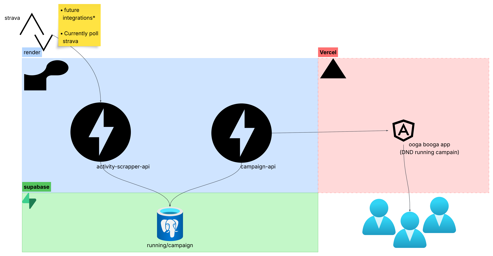

## General Orchestration

### 🏃 activity-scrapper-api
- Polls Strava once a day to fetch physical activity data.
- Ideally, this service would subscribe to Strava webhooks to receive real-time updates, but polling is significantly cheaper (free!)
- Responsible for saving physical activity data to the shared database: `activity_campaign_db`.
- Future fitness integrations (e.g., Apple Health, Fitbit) could be added here.
- Planned deployment: **FastAPI + SQLAlchemy** on **Render** (free tier).

---

### 🎯 campaign-api
- This is the cooler part of the system.
- Uses physical activity data to generate and evolve a D&D-style campaign.
- **MVP Concept**:
  - Each activity (distance, pace, time of day, etc.) is run through a D&D simulation.
  - The outcome is saved to the shared database.
  - The current campaign state is returned to the user.
- Goal: Keep it **simple and dumb** for now — just get the idea flowing.
- Planned deployment: **FastAPI + SQLAlchemy** on **Render** (free tier).

---

### 🗃️ activity_campaign_db
- Shared **PostgreSQL** database hosted via **Supabase**.
- Stores physical activity data and campaign outcomes.

---

### 🧙 oga booga app (Frontend)
- Angular-based front-end for the D&D running game experience.
- Planned deployment: **Vercel** (free tier).

## 🧱 Free-Tier Stack Summary

| Layer           | Service     | Free Tier                | Notes                                      |
|----------------|-------------|--------------------------|--------------------------------------------|
| Frontend        | Vercel      | Unlimited hobby sites    | Angular app → consider Netlify for "profits" |
| API Backend     | Render      | Free web service         | FastAPI                                    |
| Database        | Supabase    | 500 MB–1 GB              | PostgreSQL                                 |
---

MISC:
* https://developers.strava.com/docs/getting-started/
